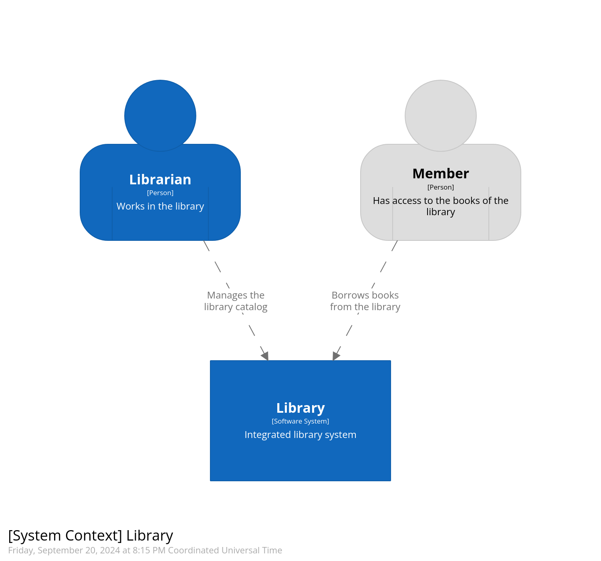
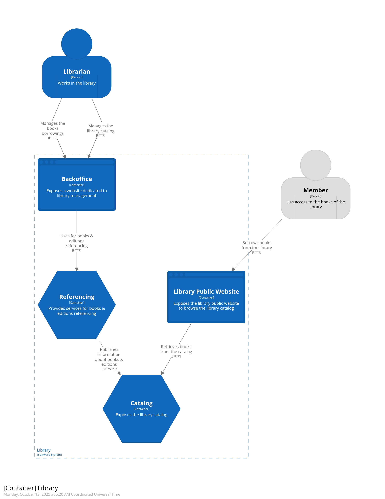
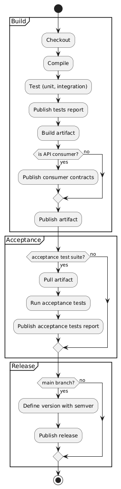

# Library

This is an opensource project aimed at demonstrating the usage of many different tools and practices in a concrete
example of library system.

Those tools and practices include:

- the [C4 model](https://c4model.com/) and tooling to generate schemas from the model.
- architecture decision records to follow the decisions about key architecture choices during the project lifecycle,
  using the [MADR](https://github.com/adr/madr) template to structure those ADRs.
- the [Event Storming](https://www.eventstorming.com/) workshop,
  especially [Big Picture Event Storming](https://github.com/ddd-crew/eventstorming-glossary-cheat-sheet?tab=readme-ov-file#big-picture-eventstorming)
  to discover the business flows and use it to identify
  the [bounded contexts](https://martinfowler.com/bliki/BoundedContext.html) to split the solution.
- the [Continuous Delivery](https://martinfowler.com/bliki/ContinuousDelivery.html) development approach, based on the
  corresponding [Accelerate capabilities](https://itrevolution.com/articles/24-key-capabilities-to-drive-improvement-in-software-delivery/)
  achievement.
- the API specification-first approach, bringing high quality documentation and automatic basic validation.
- the [Behavior-driven Development](https://en.wikipedia.org/wiki/Behavior-driven_development) (BDD) approach to define
  features specifications and relevant acceptance scenarii, and automate the execution of those scenarii using JUnit and
  [Cucumber](https://cucumber.io/).
- the [Consumer-driven Contract testing](https://martinfowler.com/articles/consumerDrivenContracts.html) pattern, to
  ease the maintainability of APIs from the viewpoint of the providers, based on the definition of the API usage by the
  consumers. This pattern is implemented with the [Pact](https://docs.pact.io/) tool.
- the usage of [circuit breakers](https://martinfowler.com/bliki/CircuitBreaker.html) and timeouts to guarantee the
  resilience of a client against its service providers, using [Resilience4j](https://resilience4j.readme.io/) integrated
  with [Spring Cloud Circuit Breaker](https://docs.spring.io/spring-cloud-circuitbreaker/reference/index.html).
- the usage of traces for [observability](https://quality.arc42.org/qualities/observability), implemented with
  [Micrometer](https://micrometer.io/) and [OpenTelemetry](https://opentelemetry.io/), and the usage
  of [Zipkin](#observability-with-zipkin) to centralize and display those traces generated by the different
  applications.

## TL;DR

First follow the [installation guideline](./INSTALLATION.md).

Then start the library system running the following commands:

```shell
make clean && make
make start
```

You can now browse to the [Library Website](https://localhost:9000/) in your local environment.

To stop the library system, run the `make stop` command.

## Project structure

### Mono-repository applications

The project is structured as a mono-repository, with each individual application (i.e. [C4 model](https://c4model.com/)
container) having its dedicated folder (e.g. [catalog](./catalog) for the catalog API).

Here is the C4 system context diagram of the Library system:



And the container diagram representing the Library system:



### Tooling and documentation

Some other folders provide general purpose content:

- the [doc](./doc) folder hosts the documentation and tooling to generate it, in an architecture-as-code approach.
- the [docker](./docker) folder contains the global configuration to run the system in a docker environment.
- the [libs](./libs) folder contains some shared libraries used by the different applications.
- the [pact](./pact) folder hosts the [Pact](https://docs.pact.io/) artifacts shared between the different applications
  to implement the Consumer-driven Contract testing pattern, and the tooling to start a
  [pact broker](https://github.com/pact-foundation/pact_broker) used in the continuous delivery pipeline.
- the [ssl](./ssl) folder contains certificates for localhost environment.

## Business discovery

### Borrowing a book

Here is the result of the event storming about the goal of "Borrowing a book":


## Usage

Each application provides a `Makefile` with similar targets to build and run the application. Use `make help` to get the
list of all available targets and their purpose.

Here is a list of the common targets:

- `build` to build the application as a docker image.
- `start` to start the application and all its dependencies using docker compose.
- `stop` to stop the application previously started with `start`.
- `acceptance` to run the application's acceptance tests in a docker compose environment.

In addition to those application specific `Makefile`, the root folder provides its own `Makefile`. Thus, from the root
folder you can reach the previous targets for each application, in the form of `<target>-<app>`, replacing the
`<target>` by the name of the target and the `<app>` suffix by the name of the application _(e.g. `build-catalog` for
the catalog app)_.

The root `Makefile` can also be used to execute some common tasks, such as:

- `structurizr` to generate the Structurizr C4 diagrams.
- `start-pact-broker` to start the environment of the Pact broker used in the Consumer-driven contract testing pattern.
  The broker provides a UI available at [`http://localhost:9292`](http://localhost:9292).
- `stop-pact-broker` to stop this Pact broker.

### Environment configuration

To configure the execution environment, you can create a `.env` file at the root of the project, in which you can
declare properties that will be used during execution. By default, those values are set as:

```properties
PACT_BROKER_PORT=9292
CATALOG_API_PORT=8080
REFERENCING_API_PORT=8081
WEBSITE_PORT=9000
ZIPKIN_PORT=9411
```

### OpenAPI documentation exposition

By default, each application exposing an API provides a Swagger UI to browse the OpenAPI specification. By default, when
running the applications with `make start`, you will have access to those API documentation pages:

- [Catalog API](https://localhost:8080/swagger-ui/index.html)
- [Referencing API](https://localhost:8081/swagger-ui/index.html)

### HTTP2 activation

HTTP2 is enabled by default in each application configuration, but won't be used by default if you don't configure a
keystore for the application and activate HTTPS.

The applications therefore provide a `local` configuration, that can be enabled through a Spring profile (i.e. add the
`--spring.profiles.active=local` to the program execution arguments). By default, the local profile configures the
self-signed certificates found in the `./ssl` folder to be used for HTTPS. If the local profile is not active, the
services will be exposed by HTTP (instead of HTTPS) and HTTP2 won't be available (replaced by HTTP1.1).

A different certificate, with different subject, is also configured to enable HTTPS for docker compose in local
environments. Each application exposed as a dependency in a docker compose local environment (e.g. catalog for website)
will have its own certificate with appropriate subject.

#### Certificate generation

Certificates are generated using the [`openssl`]() tool, through a command like (source:
[Let's Encrypt](https://letsencrypt.org/docs/certificates-for-localhost/)):

```shell
openssl req -x509 -out localhost.crt -keyout localhost.key \
  -newkey rsa:2048 -nodes -sha256 \
  -subj '/CN=localhost' -extensions EXT -config <( \
   printf "[dn]\nCN=localhost\n[req]\ndistinguished_name = dn\n[EXT]\nsubjectAltName=DNS:localhost\nkeyUsage=digitalSignature\nextendedKeyUsage=serverAuth")

openssl pkcs12 -export -in localhost.crt -inkey localhost.key -name localhost -out localhost.p12
```

### Observability with Zipkin

[Zipkin](https://zipkin.io/) is a distributed tracing system, that we will use to gather all traces from the different
applications we deploy.

#### Zipkin run with application

Zipkin is directly configured when running a single application through its `make start-<app>` target, and when running
the global system through the `make start` target.

By default, you can access it at [`http://localhost:9411`](http://localhost:9411).

#### Zipkin run for development

If you need to run Zipkin in your local development environment, you can run the `make start-observability` target.

By default, you can access it at [`http://localhost:9411`](http://localhost:9411).

Just stop Zipkin running the `make stop-observability` target.

### Continuous Delivery pipeline

A generic pipeline is defined for all applications to enforce continuous delivery development:


