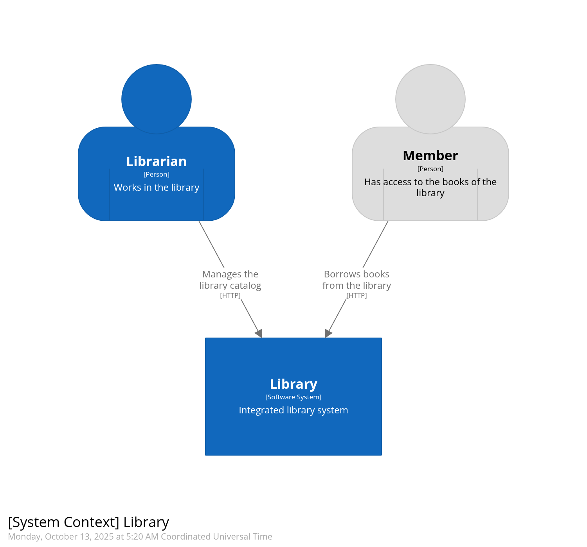

# Library

This is an opensource project aimed at demonstrating the usage of many different tools and practices in a concrete
example of library system.

Those tools and practices include:

- the [C4 model](https://c4model.com/) and tooling to generate schemas from the model.
- the API specification-first approach, bringing high quality documentation and automatic basic validation.
- the [Behavior-driven Development](https://en.wikipedia.org/wiki/Behavior-driven_development) (BDD) approach to define
  features specifications and relevant acceptance scenarii, and automate the execution of those scenarii using JUnit and
  [Cucumber](https://cucumber.io/).
- the [Consumer-driven Contract testing](https://martinfowler.com/articles/consumerDrivenContracts.html) pattern, to
  ease the maintainability of APIs from the viewpoint of the providers, based on the definition of the API usage by the
  consumers. This pattern is implemented with the [Pact](https://docs.pact.io/) tool.

## Project structure

### Mono-repository applications

The project is structured as a mono-repository, with each individual application (i.e. [C4 model](https://c4model.com/)
container) having its dedicated folder (e.g. [catalog](./catalog) for the catalog API).

Here is the C4 system context diagram of the Library system:



And the container diagram representing the Library system:


### Tooling and documentation

Some other folders provides general purpose content:

- the [doc](./doc) folder hosts the documentation and tooling to generate it, in an architecture-as-code approach.
- the [pact](./pact) folder hosts the [Pact](https://docs.pact.io/) artifacts shared between the different applications
  to implement the Consumer-driven Contract testing pattern, and the tooling to start a
  [pact broker](https://github.com/pact-foundation/pact_broker) used in the continuous delivery pipeline.

## Usage

Each application provides a `Makefile` with similar targets to build and run the application. Use `make help` to get the
list of all available targets and their purpose.

Here is a list of the common targets:

- `build` to build the application as a docker image.
- `start` to start the application and all its dependencies using docker compose.
- `stop` to stop the application previously started with `start`.
- `acceptance` to run the application's acceptance tests in a docker compose environment.

In addition to those application specific `Makefile`, the root folder provides its own `Makefile` that can be used to
execute some common tasks, such as:

- `structurizr` to generate the Structurizr C4 diagrams.
- `start-pact-broker` to start the environment of the Pact broker used in the Consumer-driven contract testing pattern.
  The broker provides a UI available at [`http://localhost:9292`](http://localhost:9292).
- `stop-pact-broker` to stop this Pact broker.

### Environment configuration

To configure the execution environment, you can create a `.env` file at the root of the project, in which you can declare
properties that will be used during execution. By default, those values are set as:

```properties
PACT_BROKER_PORT=9292
CATALOG_API_PORT=8080
WEBSITE_PORT=9000
```
